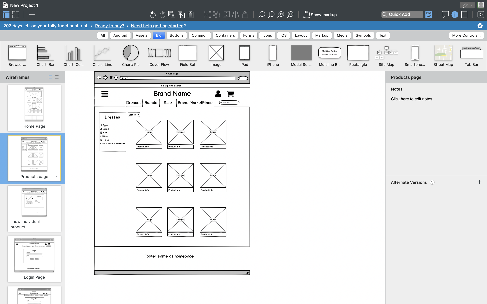
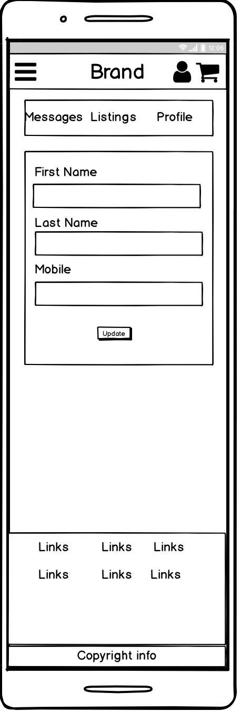
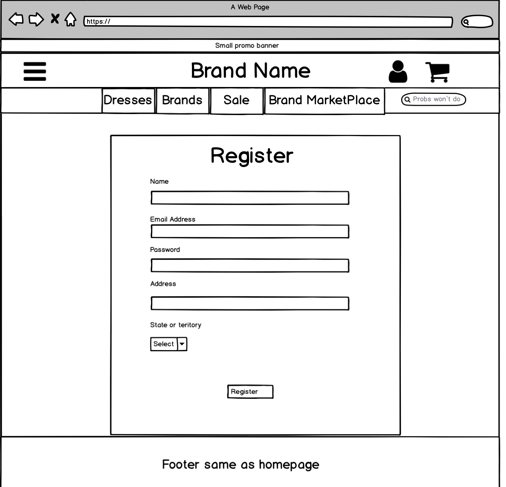

## Dress Retail/Marketplace app

link to app: https://radiant-fjord-27151.herokuapp.com/

Link to gitbub: 

#### Problem Solved by this marketplace app

Today, there are many marketplace applications that allow users to interact and buy and sell products. Often, the problem with these marketplace applications is that they cater to a diverse category of items, making it hard to find quality items in markets that aren't as prominent. This application, faces as both an online dress retailer, with an integrated buy and sell marketplace for its users. The specific and targeted audience of the app allows for users to interact with a concentrated selection of products available to them. This increases user satisfaction when looking to sell or buy dresses in an online marketplace environment. By creating a platform with a focused target audience looking for a specific item category (dresses), we solve the problem of individuals scouring through multiple diversified marketplace applications to find the dresses they are looking for. 

#### Why is it a problem that needs solving

To provide individuals looking to buy and sell dresses a consistent marketplace and website in which provides a diverse and extensive range of items to choose from, or users to sell to. 

#### Description of my marketplace app

###### Purpose

The purpose of this marketplace application is to deliver a specific category of items to users looking to buy or sell dresses in an online marketplace environment. 

###### Functionality/Features

User feature: Anybody has access to both the Retail store and the marketplace sections of the application, and are allowed to browse these items without having to become a user. If an individual would like to create their own listing, or message other users, they will have to register and become a user. Users will have their own individual private profile, and are able to create listings and message other users who have adverstised their own listings.

Online dress Retail store: This Application has an online dress retail store component in which anybody can browse the site for new dresses of a variety of styles, sizes, brands and types. On this part of the website, users can add these items to their cart to purchase if they desire. 

Marketplace: Users will be able to create and edit their own listings in order to sell dresses of their own. Side of the application represents the user to user buy and sell concept of a typical online marketplace. 

Messages: Users will be able to message other users who have a listing currently available. These users will have access to every conversation they have engaged in with other users on the application. 

Session Cart: Users browsing the retail section of the application will be able to add products for sale to their cart. These products will stay in their cart if they wish to continue and purchase these products. 

###### Target audience

The target audience of this application is anybody who wishes to buy or sell dresses on a marketplace platform, as well as users who wish to buy brand new dresses from the retail store. 

###### Tech stack

This application is built using the following:

- HTML
- CSS
- Ruby on Rails
- Bootstrap
- Postgresql database
- Deployed on heroku

###### Sitemap

###### Screenshots

do later

#### User stories

- As a user, I am browsing for a dress but am not commited to anything. I want to enter the website, search for targeted brand or styles of new dresses and add these to my cart. I can also look at any listings posted on the marketplace section of the application. 
- As a user, I want to sell a dress on the marketplace application. I am prompted to register as a user and complete registration. I can then create as many listings for the dresses id like to sell, and attach the photos of the dresses id like to sell. 
- As a user, I want to buy a dress off another user on the marketplace website, I can search for listings close to me. When I find a listing i like, I want to message the owner of this listing. I am first prompted to register, and then I can send this user a message inquiring about their listing so I can organise to buy the dress off the user. 
- As a user, I want to buy a new dress, I enter the website and search for the brand or styles I would like to purchase, I can add these dresses to my cart and go foward to buying these dresses. 
- As a user, I want to enquire about a listing I posted on this website, I access the contact us page where I am able to find details as to how I can get in touch with the business. 

#### Wireframes

Home page:

Product/listings search:

Indivdual product/listing page:

Cart page: 

Profile page:

Conversation page:

Manage listings:

Pages that keep the same layout over all sizes:

#### ERD

#### High level components of application

Retail Store: This allows users to browse new dresses through unfiltered or filtered searches, each dress can be viewed on an individual page where in they can see more details about the product and add this product to their session based cart. The cart session is initialised when a user first adds an item to a cart. Items users add to this cart can be removed as they please. 

Marketplace Listings: In the dedicated marketplace page on the application, users are able to search through all listings in a filtered or unfiltered search, they are able to filter their search based on location, style, or brand. These Listings can be viewed on an individual page in which they can see more information about the listing, and send a message to the owner of that listing if they, themselves are a registered user. 

User profiles and Registration: Some features, such as creating listings and messaging listing owners are restricted to registered users online. Each user can register simply by entering an email and their chosen password. They will also be instructed to create a profile and enter their name and mobile number. Users are able to change their passwords if forgotten, and update their profile information if they are signed in. 

Messaging: Users will be able to message other users via theyre listing. Only users who have listings are able to be messaged from other users to inquire about the listing. When a conversation is started between a user inquiring about a listing, either user can message each other and find their conversations in their conversation dashboard. 

Session based cart: The session based cart is designed for the Retail side of the application, and allows users to collect and store items they like in their cart. The cart page will display all the products the user has added to their cart, and will be the page in which they can confirm their order and move through to payments. 

#### Detail any third party services used by the app. 

This application is built using postgresql database system, Devise authentication gem, Bootstrap the HTML, CSS and JS framework, and deployed on Heroku. 

Postgresql: Postgresql is an open source object relational database systems that uses SQL. This third party service is the database used for my marketplace web application. Implementing the postgreql database in our marketplace application allows us to create a dynamic platform in which can store user data, and design an buy and sell listings feature with crud functionality. 

Devise: Devise is a ruby gem that is used as an authentication solution within the marketplace application. It provides many classes, controllers, routes and views which are implemented within the application. User registration and sign in are implemented within this marketplace application using devise. It alos provides a number of simple helper methods which have been used consitently throughout the app to controll user authorisation and authentication amoungst features within the app which are restricted to registered users. 

Bootstrap: Bootstrap is a framework with a collection of reusable pieces of primarily CSS code. It is implemented to build the front end of the marketplace application. Bootstrap is a framework in which you can utilise pre-written code to quickly develop responsive features within any application. Bootstrap has been used in this marketplace to build and style the front end and enhance the user experience within the application.

Heroku: Heroku is a cloud platform as a service. It is a platform in which the marketplace application is deployed and hosted on. 

#### Describe relationships between models

#### More needed on this...

The models used in this application are: Style, Brand, Size, State, City, Postcode, Product, Listing, Profile, User, Conversation, Message.

Style, Brand, Size models has a has_many relationship with both the Product and Listing model.

Style, Brand, Size, State, City, Postcode models has a has_many relationship the the Listing model. 

Profile Model has a belongs to relationship with the User model. 

Conversation model has a has many relationship with the message model, and Belongs to relationship with User model, in a way that users can be identified as a sender or recipient. 

Message model has a belongs to relationship with the User model and the Conversation model.

Product model has a belongs to relationship with the Brand, Size, Style model. 

Listing Model has a belongs to relationship with Brand, Size, Style, State, City, Postcode and User model. 

User model has a has one relationship with the Profile model, a has many relationship with the Listing model, Message model, and Conversation Model. 

#### Database schema design

#### Describe the way tasks are allocated and tracked in the project

Throughout this project, tasked were tracked and allocated using the trello management platform. Within my project board, I separted tasks in six categories. 

The first stage was organising and intitialising my "to do lists", one for the development of the marketplace application, and one for the Documentation required within this assignment. The first stage of planning involved creating an ordered lists of tasks I needed to perform in both development and documentation, and a thought out process of how these tasks will be implemented, and in what order. 

The second stage was moving tasks that I had started into "In progress" cards, so I could manage how many tasks I was trying to acheive at once, and maintain an organised development process in which, I approached and completed tasks before moving onto other tasks where possible. Keeping these card lists as skinny as possible helped the development process for this marketplace application. 

The final stage of allocating and tracking my tasks was to place them within a "completed" card for either documentation or development. This allowed me to keep track of the tasks which no longer needed attention so I could prioritise my time on tasks that did. 

The final card was for bugs and features that needed fixing. This was used to set aside tasks that I had been trying to implement and develop for a while without success, or alternatively, had discovered after writing my code and testing the application from the user end. This allowed me to keep track of features within my app that had flaws that might've gone un-noticed during development. 

This process was a continuos loop of organising and allocating tasks I needed "To do",  making "Progress" on these tasks, "Completing" the tasks and reviewing flaws as they arise within my final card. 

